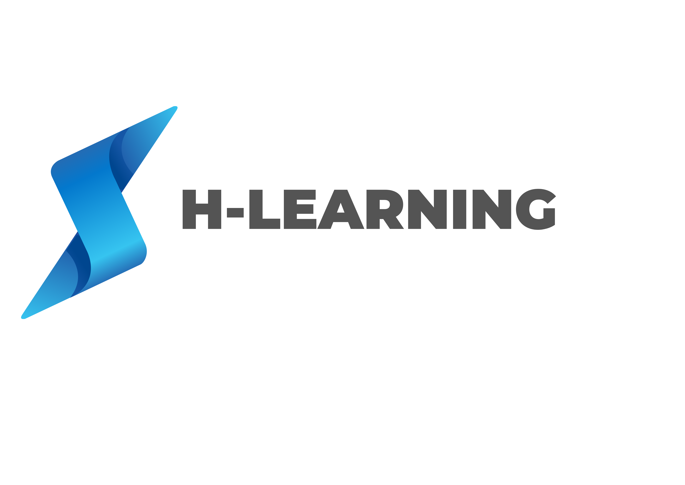
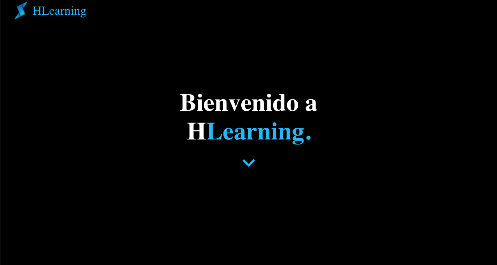
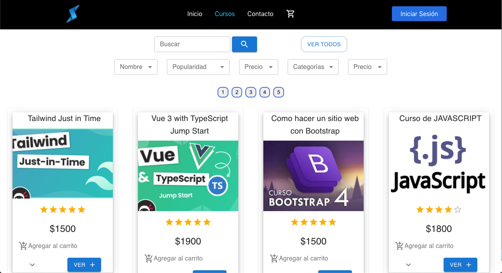
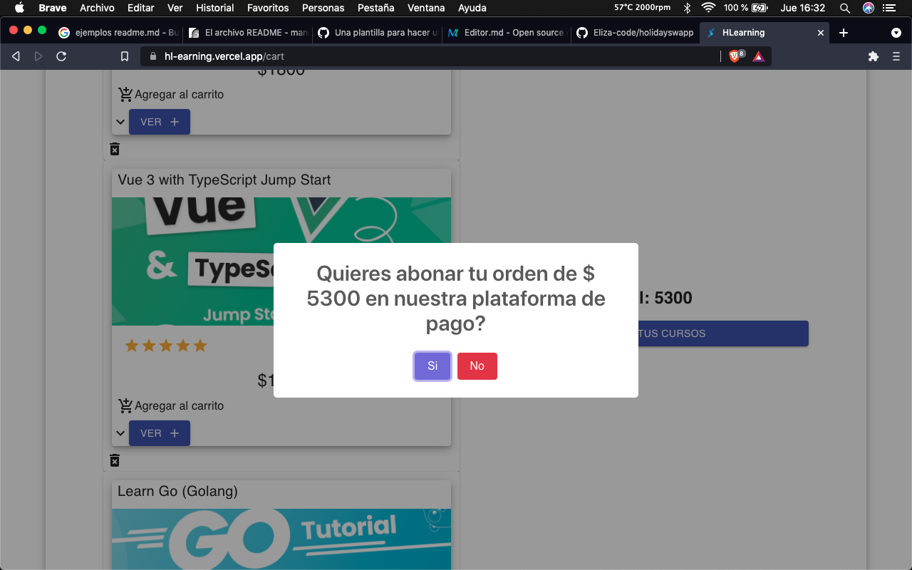
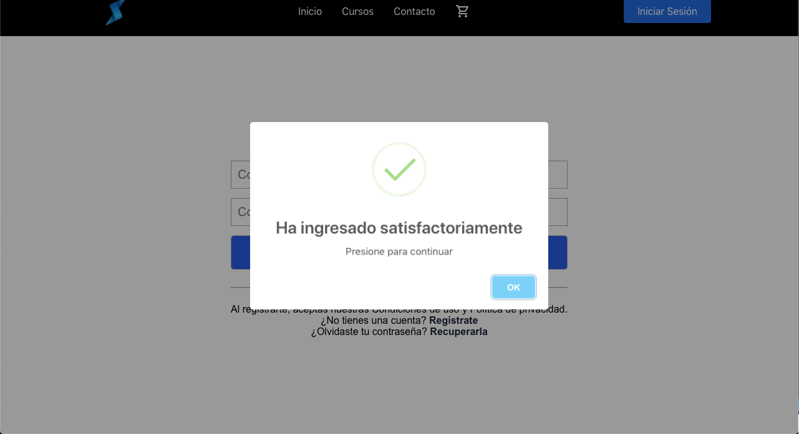
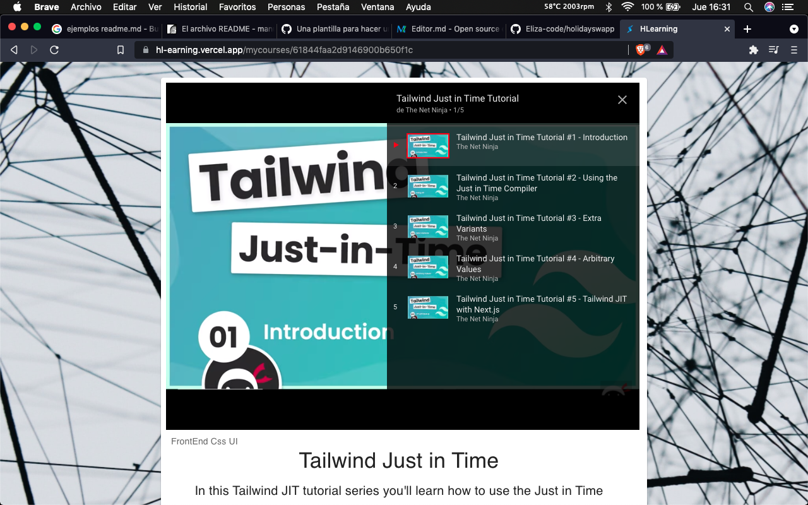
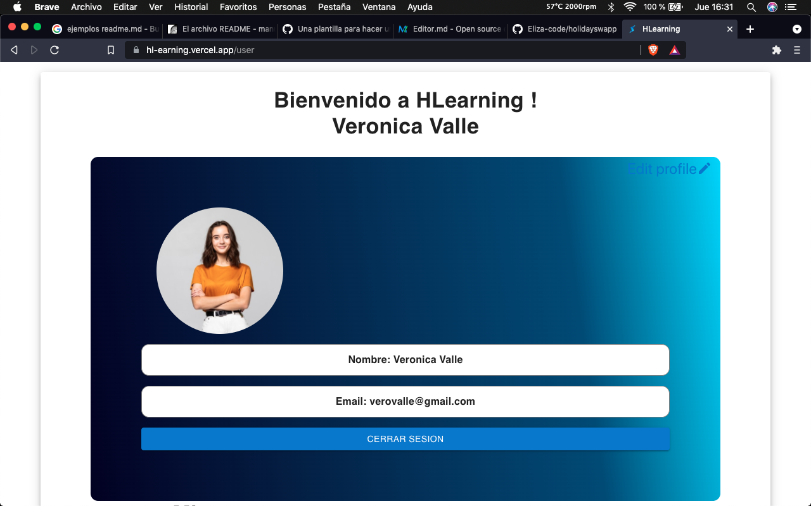
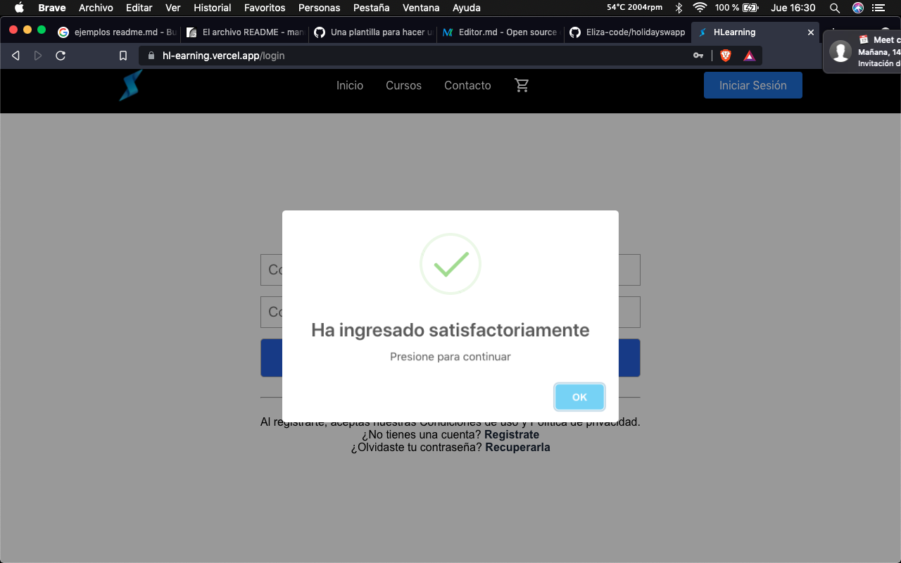

#

#### H-Learning es un proyecto eCommerce destinado a la venta de cursos online con orientacion a la educación IT. La misma cuenta con dos roles de usuarios, el primero como estudiante, en la cual podes acceder a los cursos comprados, editar tu usuario, avatar, crear una reseña del curso entre otras. La segunda cuenta con un administrador, lo cual permite, crear, editar o dar de baja un curso, como a una categoria del mismo entre otras funcionalidades de su rol. 

#

#### Tech Stack :

           
  

#

#### Para utilizar este proyecto, es necesario crear un archivo .env dentro de la carpeta api, y una en client a su vez establecer las siguientes variables:

#### Api:
```
DB_URL=mongodb+srv: Cloud Atlas link
PORT = 9000
SECRET_KEY = secret key
MP_TOKEN = token test
API_URL = https://hlearning.herokuapp.com
CLIENT_URL=https://hl-earning.vercel.app/
```
#### Client: 
```
REACT_APP_BASE_URL = https://hlearning.herokuapp.com
REACT_APP_CLOUD_NAME = hlearning
REACT_APP_UPLOAD_PRESET = yqjnrvm7
REACT_APP_EMAIL_TEMPLATE = template_or9mjrn
REACT_APP_EMAIL_USER = user_GdBu7T9DTHFnIo5cvAyNk
```
#

#### Para ingresar a la web haz click en [H-Learning!](https://hl-earning.vercel.app/) 
#


#### Algunas imagenes de la app: 










#

#### Developers: 

##### Cecilia Woitasen | [Linkedin](https://www.linkedin.com/in/cecilia-woitasen-dev/) | [Github](https://github.com/CeciliaWoi)
##### Micaela Fossati | [Linkedin](https://www.linkedin.com/in/v-micaela-fossati/) | [Github](https://github.com/MFOSS13)
##### Yamila Paez | [Linkedin](https://www.linkedin.com/in/yamila-paez-70b7587b/) | [Github](https://github.com/Bellantra)
##### Andrés Benvenuto | [Linkedin](https://www.linkedin.com/in/andr%C3%A9s-benvenuto-a2b38a15a/) | [Github](https://github.com/andresbenve)
##### Gonzalo Galdame | [Linkedin](https://www.linkedin.com/in/gonzalo-galdame-dev/) | [Github](https://github.com/gonzalohlh)
##### Joaquin Caubarrere | [Linkedin](https://www.linkedin.com/in/joaquin-caubarrere/) | [Github](https://github.com/joacocoba)
##### Roman Cardozo | [Linkedin](https://www.linkedin.com/in/romancardozo-fullstackdeveloper/) | [Github](https://github.com/romacardozx)
##### Lihue Lautaro Maidana Avaca  | [Linkedin](https://www.linkedin.com/in/lihue-maidana-avaca/) | [Github](https://github.com/LihueMaidanaAvaca)
##### Maximiliano Requena  | [Linkedin](https://www.linkedin.com/in/maximilianorequena/) | [Github](https://github.com/maxxrequena)

#

#### TL Proyect (by Henry) :
##### Daniel Maers  | [Linkedin](https://www.linkedin.com/in/danielmaers//) | [Github](https://github.com/danielmaers)

